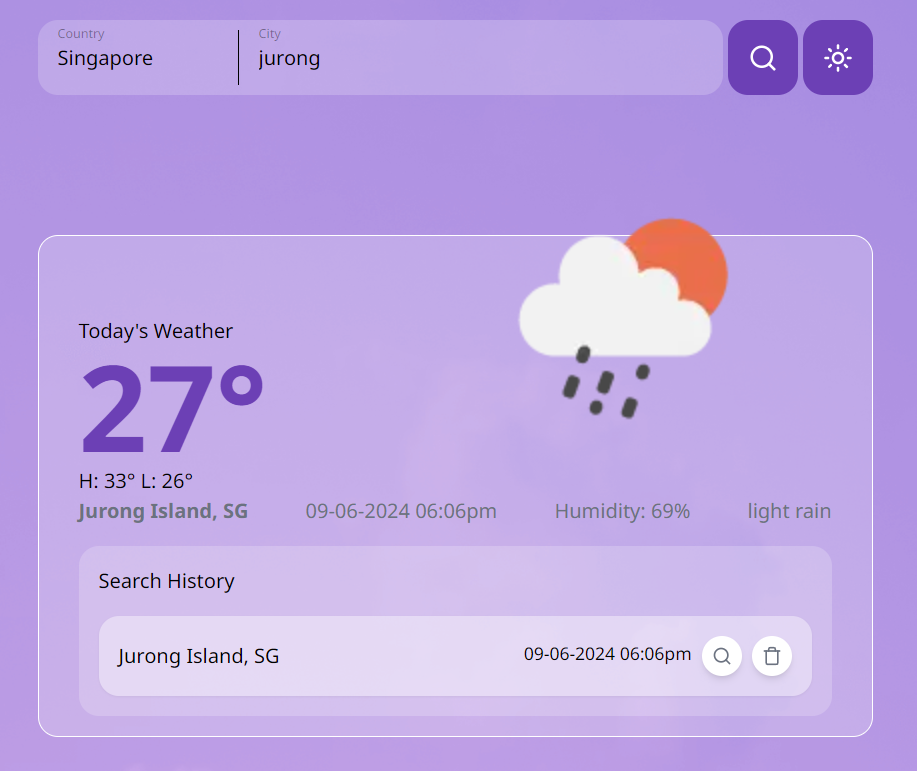
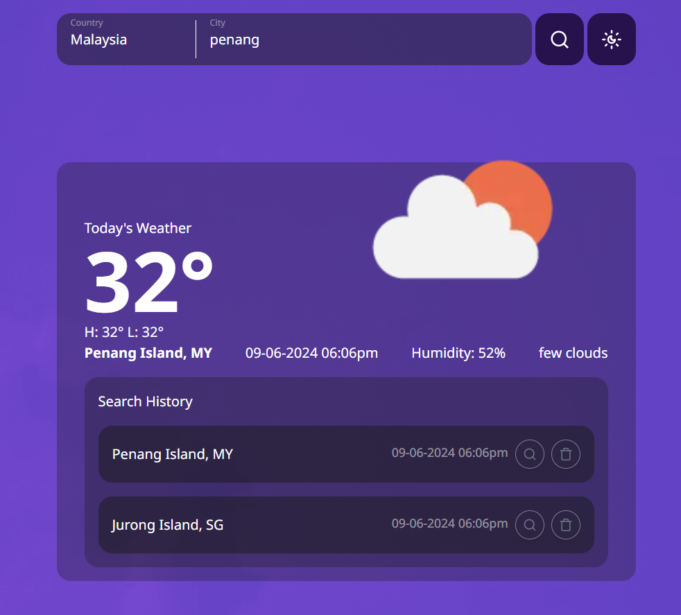

# Summary

This is a weather app example made using TypeScript, Next.js, Tailwind CSS, and some useful libraries ( you can refer to the package.json file for more information). It utilizes the OpenWeather Geocoding API (https://openweathermap.org/api/geocoding-api) to retrieve latitude and longitude based on user's country and city input. It then queries weather data using the OpenWeather API (https://openweathermap.org/current) with the provided latitude and longitude.




# Get Started

To get started, create a .env.local file and fill in the OpenWeather API key from https://openweathermap.org/. You can refer to the .env.local.example file for reference.

After that run,

```bash
npm install
```

to install all the required dependencies
then run

```bash
npm run dev
```

to start the development environment.
